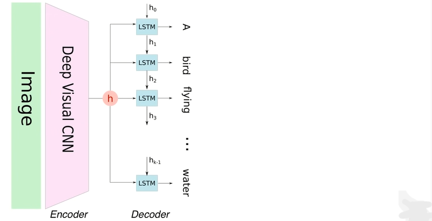

### **Attention Neural Network**
**What is Attention?**
###### **Suppose I give you the `Deep Learning with Python` book and ask you to tell me about `neural style transfer` from the book. What would you do? - either start reading the whole book or check the index to find out where "neural style transfer" is talked about, go there and read the related portion. The second way is more precise because you draw the attention in the region of interest.**
**Understand Attention Mechanism**
###### **To understand attention mechanism, here we will consider `Image Captioning through Attention`. How we can caption an image?- The basic idea is- We will `Encode` the input image by a `CNN` then `Decode` the encoded representation by a `RNN(say-LSTM)` into word vector(ie. Caption).**

> ###### **`Image -- (Encoded by CNN) --> H -- (Decoded by LSTM) --> Caption`   where H=internal vector representation, Caption=into word vector.**
###### **`[NB]`The problem is, for captioning the image, LSTM consider the entire image vector representation(H). This is not an efficient way, because- we actually caption a specific region not the whole image. `How to solve this?`- We can create non-overlapping subregion of the image and focus on specific region.**
> ###### **`Image -- (Encoded by CNN) --> (h1.....hn) -- (Decoded by LSTM) --> Word vector`**
**How to focus on Specific Region?**
**Attention Mechanism**
###### **An attention unit considers all the subregions and contexts as its input and outputs the weighted `arithmetic mean` of these regions. **`What is Arithmetic Mean?`- the inner product of actual values and their probabiliies. `How the Probabilities and Weights deternmine?`- using the `context`. `What is context?`- Context represents everything that `RNN` has output.**
**Attention Unit**
###### **We have- inputs(y) from CNN and context(C) from RNN. These inputs then applied to the weights which constitute the learn about parameters of the attention unit. That means the weight vectors update as we get more training data.`??`**
> ###### **`m_1 = tanh(y_1.w_1 + C.w_c)`**
###### **the `tanh` activation fn scales the values between (-1 to 1), which leads to a much smoother choice of regions-of-interest within each sunregion.`???`**
###### **`[NB]` We can choose regions-of-interest by applying a simple dot product of regions(y) and context(c). The higher the product, the more similar they are.  The difference between using the simple dot product and tanh function would be granuality(level of details in a set of data). Tanh is more fine-grained(involving great attention of details) with less choopy(having a disjoined or jerky quality) and smoother for subregion choice.**
`[Pic]`
###### **These m's(m_1.........m_n) are then pass through a softmax fn which outputs them as probabilities(s_1.........s_n). Finally, we take the inner product of probability vector(S) and subregions(y) to get the final output(Z), the relevant region of the entire image.**
> **`Understand the probabilities as correspond to the relevance of the subregions(y) given the context(C).``???` **

**Types of Attention** 
**1. Soft Attention:**  *[The main relevant region(z) consists of different parts of different sub-regions(y)]*
> ###### **`Z = sum(s_n.y_n)`    where, s=probabilities of the sub-regions(y).
###### **Soft Attention is deterministic. What "deterministic" means?- A system is said to be deterministic if the application of an action(a), on a state(s), always leads to te same state(s')**
> ###### **`(S)-----(a)------>(S');`    Changes the coordinates from `S` to `S'` but the state doesn't.**
###### **For example, Suppose, you face to the forward standing in the corner of a room and you then one step ahead to the forward stil facing to the forward. That changes your location(coordinates) but your state remains same.**
**2. Hard Attention:**  *[The main relevant region(z) consist of only one of the regions(y)]*
###### **Instead of taking weighted arithmetic mean of all regions, hard attention only consider one region randomly. So, hard attention is a `stochastic` process. What `stochastic`(Randomness) mean?- Performing an action(a), on a state(S) may lead to different states every time.**
> ###### **`(S)-----(a)------>(S'/S''/S''')`    Holds different probabilities than the same everytime.**
###### **`What makes Hard Attention stochastic?-` is that a region(y_i) is chosen randomly with the probability(s_i). The more relevant a region(y_i), as-a-whole is relevant to the context, then grater the chance it is chosen for for determinig the next word of the caption.**

**Lets apply the same concept of soft-attention**
###### **Initially, we have an image split into a number of regions(y_i) with an input context(C). This is our initial state. On the application of soft detection we end up with a localized image representing the new state(S'). These regions of interest are determined from (Z). The output will always be the same regardless of how many times we execute self-attention with these same inputs. This is because we consider all the regions(Y) anyways to determine (Z).**
**Performance**
* ###### **Performance varies on dataset.**
* ###### **Hard attention perform slightly better while soft-attention perform decently well.**
**Application**
* ###### **`Neural Machine Translation (translate one language to another)` - Words are fed in a sequence to an encoder one after another and the sentence in terminated by specific input word or symbol. Once complete, the special signal initiates the decoder phase where the translated words are generated.**
* ###### **`Teaching Machines to Read`**